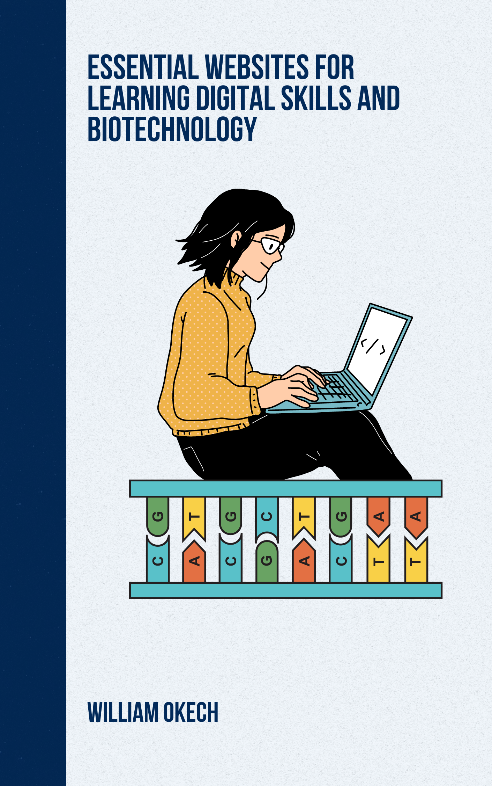

# Welcome

This is the website for the book “Essential Websites for Learning Digital Skills and Biotechnology” written by [William Okech](https://www.williamokech.com). This book is primarily intended to provide links to essential websites for learning digital skills and biotechnology.

[Essential Websites for Learning Digital Skills and Biotechnology](https://wokech.github.io/essential_websites)© 2024 by [William Okech](https://www.williamokech.com/) is licensed under [CC BY-NC-ND 4.0](http://creativecommons.org/licenses/by-nc-nd/4.0/?ref=chooser-v1). The online version of this book is free to use.

Cover image was designed using [Canva](https://www.canva.com/).

This book was built with [Quarto](https://quarto.org/).
